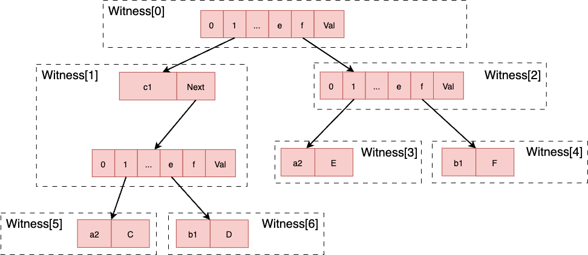

# FAQ

## Why Keep The L1 Account Trie?

There are several reasons to keep it:

*   The size of the L1 account trie is relatively small, constituting only around 4% of the L2 storage trie on BSC as of the end of 2022.
*   The L1 account trie contains crucial information about user accounts, such as their balance and nonce. If users were required to revive their accounts before accessing their assets, it would significantly impact their experience.
*   By retaining the L1 account trie, the witness verification process can be much simpler.

## Why Not Create A New L2 Storage Trie?

In this proposal, the trie skeleton will be kept in a new epoch. There are other approaches 

which will generate a new trie tree from scratch at the start of a new epoch. Although they

provide a comprehensive solution for state expiry, there are still two unsolved issues to address: account resurrection conflict and witness size. Additionally, they would have a significant impact on the ecosystem and rely on other infrastructure, such as address extension and Verkle Tree.

By keeping the skeleton of the trie, it would be much easier to do witness verification and have less impact on the current ecosystem.

## Reasonable Epoch Period

The state will expire if it has not been accessed for at least 1 epoch or at most 2 epochs. On average, the expiry period is 1.5 epochs. If we set the epoch period to represent 2/3 of a year, then the average state expiry period would be one year, which seems like a reasonable value.

## What is the shadow tree?

A shadow tree is a shadow mapping to the MPT and can be accessed directly by the MPT. Each MPT node corresponds to its shadow node. For example, BranchNode corresponds to a ShadowBranchNode and ExtensionNode corresponds to a ShadowExtensionNode. In ShadowBranchNode, it contains an epoch map that will indicate if its child node is expired.

## What is Partial Revive?

When a high-level layer is revived, the actual witness depth may decrease If it is 2 or even 1, only leaf node witnesses are included, and the witness size is the smallest.



When `Witness[0]`, `Witness[1]`, `Witness[5]` revive `state C` on chain, you only provide `Witness[6]` to revive `state D` .

## How about witness size?

It depends on the unrevived Trie path, and revive by Partial Revive Mechanism. This is a reference to restore the witness size of a 7-layer Trie:

*   Max Witness, depth 4, size 1451 Bytes, gas 24740;
*   Min Witness, depth 1, size 42 Bytes, gas 1300;
*   Avg Witness, depth: 2, size 319 Bytes, gas 6012;

## What is Witness Format?

```plain
type WitnessList []ReviveWitness 
type ReviveWitness struct {
	WitnessType byte              // only support Merkle Proof for now
	Data        []byte            // witness data, it's rlp format
	cache       ReviveWitnessData `rlp:"-" json:"-"` // cache if not encode to rlp or json, it used for performance
}
type StorageTrieWitness struct {
	Address   common.Address // target account address
	ProofList []MPTProof     // revive multiple slots (same address)
}
type MPTProof struct {
	RootKeyHex []byte   // prefix key in nibbles format, max 65 bytes.
	Proof      [][]byte // list of RLP-encoded nodes
}
type MPTProofNub struct {
	n1PrefixKey []byte // n1's prefix hex key, max 64bytes
	n1          node
	n2PrefixKey []byte // n2's prefix hex key, max 64bytes
	n2          node
}
```

## How to generate Witness?

You can just call `eth_estimateGasAndReviveState` , it will return `ReviveStateTx` 's WitnessList and Gas, you just send tx to network.

  

Here is a diagram:


## When is the contract slot expired?

It will expire only if it has not been accessed on the last epoch, and the slot that is always accessed will never expire. Attention, this rule is for contract slot, account data will never expire.

  

By default, an epoch is 2/3 years.

## Validator storage size compared to before?

Due to the addition of metadata to mark expired information, ArchiveNode will have a certain increase in storage scale compared with before.

  

For FullNode, because most of the historical data is not saved, and the expired data of more than 2 epochs will be expired at the same time, the storage requirement is greatly reduced, and the specific saving depends on the activity level of the chain.

  

However, most of the state of many inactive historical contracts will be pruned.

## Compare ETH's state expiry proposal

Ethereum’s solution is more inclined toward Statelessness. Of course, there are also state expiry studies, but whether it is Statelessness or state expiry, it poses a huge challenge to current ecology and historical compatibility, such as address extension, verkle tree, two-tree migration, and duplication, witness resolve state conflicts, etc.

  

However, based on the current BSC scheme, it maximizes compatibility with the ecological and historical states. There is no expired account state and no address change. It only adds a main RPC API and a state expiration certificate, making ecological adaptation easier.

  

## Why need two hard fork?

The advantage of using two hard forks is that the time to enter Epoch1 and Epoch2 can be controlled separately, and when enter Epoch2, there will appear expired state, during which we can continue to optimize and fix discovered bugs.


Of course, this design can freely control the time to enter Epoch1 or Epoch2. When everything is ready, directly enable hard fork2 to enter Epoch2 without waiting too long.

  

## Does legacy Transaction still works?

Yes, legacy Transaction still works, but users must always check if the legacy transaction will access expired state.

  

For transaction that only involves balance transfer, it can be done as usual. because of the account data is always available.

  

If there iis any expired state, New Transaction Type, ReviveStateTx could revive state from witness, and execution tx as usual.
